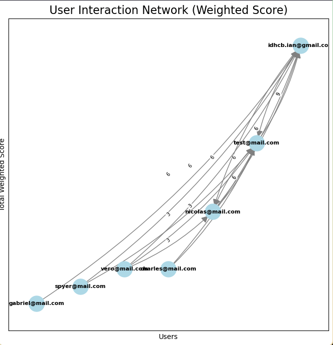
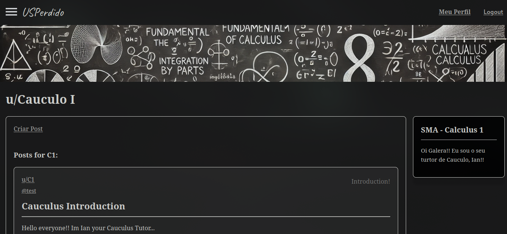

# USPerdido

# Proposta

## Uma plataforma de comunidades para conectar alunos cursando disciplinas a veteranos que já cursaram a disciplina. 

Essa plataforma tem diversas comunidades, parecido com a proposta do reddit, sendo cada uma delas as respectivas disciplinas oferecidas na plataforma(Cálculo I, Física I) e por meio de “Monitores” , que tomam o papel de Pivôs na comunidade, utilizamos um algoritmo que minimiza o output do conhecimento saindo dos monitores e minimiza o retorno de dúvidas… buscando conectar alunos com dúvidas parecidas e incentivando alunos a responderem as dúvidas e questões de outros colegas.

# Algoritimo

Este algoritmo, gera um grafo mostrando a conexão dos alunos um aos outros e relativos ao pivô, que estaria no “topo” da comunidade, assim ao final do semestre os alunos que mais ajudaram os colegas por meio de interações seriam apontados para serem os próximos monitores da matéria no ano/semestre seguinte, tendo em vista a premissa que o algoritmo mostraria a didática do aluno ao ensinar o conteúdo por meio das interações recebidas em suas respostas a dúvidas de colegas.

# Inteface

A interface gráfica se assemelha a do reddit no entanto a estrutura “social” dos usuários seria mais parecida com a de um discord de alguma personalidade/influencer, onde a proposta é oferecer liberdade aos pivôs de escolherem como se organizarem e qual tipo de conteúdo postar, visando melhor ajudar os alunos e expor o formato de maior conforto para o monitor. 

Por exemplo, na comunidade de física I o monitor pode fazer vídeos corrigindo exercícios de provas e listas escolhidas pelos alunos. Por outro lado, o monitor responsável por uma matéria como Introdução a Programação de Computadores pode fazer uma reunião online onde ele faz desafios e depois os corrige com todos.

# Implementacao / Progresso Atual

No momento a plataforma roda em um servidor de NodeJS e a interface foi criada em React, posts tipo imagem são armazenados no próprio servidor assim como posts tipo texto, no entanto posts tipo vídeo são fornecidos do youtube, necessitando que para postar um vídeo o usuário deve dar upload dele no youtube, isso facilita o problema de possíveis direitos autorais de músicas tocadas no fundo do vídeo e possibilita a realização de Lives direto na plataforma por meio do OBS/youtube  

O algoritmo já gera o grafo de interações, no entanto ele não recomenda os posts do Feed Principal de forma personalizada ao usuário, que seria direcionado a posição do usuário no grafo. 

Funcionalidades que necessárias para um futuro próximo seriam: 
Terminar o Algoritmo 
Criar recomendados baseado no Grafo
Criar Funcionalidade de Deletar posts e Usuários, Removendo também sua influência no grafo
Melhorar sistema de login( Usar Gmail)

-> // Versions //

- USPerdido_Node(Codelab Presentation)
- USPerdido_React(Basic Structure made in react)
- USPerdido_NR(Functioning Node React WF)
- USPerdido_WLGN(First try to make logins)
- USPerdido_LG(Almost all complete, W login)
- USPerdido_V1(First Working version)
- USPerdido_V2(Fist Verion Algoritim, Not Final Text)

-> // To make //

- Make text/Populate the interface
- Fix the components for many devices/phones
- Algoritim -> Main feed
- Sort communities
- Delete User
- Delete Post
- Sudo User...(Monitores)
- AWS / Ship it!!
