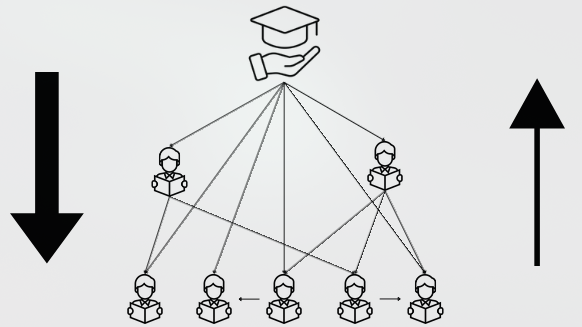

╭╮╱╭┳━━━┳━━━╮╱╱╱╱╱╱╭╮╱╱╭╮
┃┃╱┃┃╭━╮┃╭━╮┃╱╱╱╱╱╱┃┃╱╱┃┃
┃┃╱┃┃╰━━┫╰━╯┣━━┳━┳━╯┣┳━╯┣━━╮
┃┃╱┃┣━━╮┃╭━━┫┃━┫╭┫╭╮┣┫╭╮┃╭╮┃
┃╰━╯┃╰━╯┃┃╱╱┃┃━┫┃┃╰╯┃┃╰╯┃╰╯┃
╰━━━┻━━━┻╯╱╱╰━━┻╯╰━━┻┻━━┻━━╯
---------------------------------------

Uma plataforma de comunidades para conectar alunos cursando disciplinas a veteranos que já cursaram a disciplina. 

Essa plataforma tem diversas comunidades, parecido com a proposta do reddit, sendo cada uma delas as respectivas disciplinas oferecidas na plataforma(Cálculo I, Física I) e por meio de “Monitores” , que tomam o papel de Pivôs na comunidade, utilizamos um algoritmo que minimiza o output do conhecimento saindo dos monitores e minimiza o retorno de dúvidas… buscando conectar alunos com dúvidas parecidas e incentivando alunos a responderem as dúvidas e questões de outros colegas.

Este algoritmo, gera um grafo mostrando a conexão dos alunos um aos outros e relativos ao pivô, que estaria no “topo” da comunidade, assim ao final do semestre os alunos que mais ajudaram os colegas por meio de interações seriam apontados para serem os próximos monitores da matéria no ano/semestre seguinte, tendo em vista a premissa que o algoritmo mostraria a didática do aluno ao ensinar o conteúdo por meio das interações recebidas em suas respostas a dúvidas de colegas.
